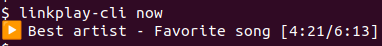

# Linkplay CLI

Control audio devices supporting the Linkplay API, from the comfort of your shell.  
Supports UPnP auto-discovery, so you don't even have to know your device's IP address.



# Installation
```bash
pip install linkplay-cli
```

After installing, run `linkplay-cli -h` to get started.

## FAQ

### I'm getting the error `command not found: linkplay-cli` 

The installed script is probably not in your `PATH`.  
Run `pip install` with the `-v` flag to find out the script's directory, and make sure that it's in your path.

### Some commands have no effect

This CLI utility is a wrapper around the Linkplay API, which may not work in all situations.  
For example, most commands won't work when the audio source is YouTube playing from your browser.
